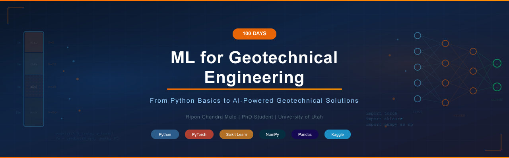

<p align="center">
  
</p>

<h1 align="center">100 Days of ML for Geotechnical Engineering</h1>


<p align="center">
  <em>From Python Basics to AI-Powered Geotechnical Solutions</em>
</p>

<p align="center">
  <a href="https://python.org"></a>
  <a href="https://pytorch.org"></a>
  <a href="https://scikit-learn.org"></a>
  <a href="https://numpy.org"></a>
  <a href="https://pandas.pydata.org"></a>
  <a href="https://kaggle.com"></a>
  <a href="LICENSE"></a>
</p>




| | |
|---|---|
| **Author** | Ripon Chandra Malo |
| **Affiliation** | PhD Student — Civil & Environmental Engineering (Geotechnical), University of Utah |
| **Research** | Granular Materials x Artificial Intelligence |
| **Start Date** | February 2026 |

---

## About This Repository

A structured 100-day journey bridging the gap between classical geotechnical engineering and modern machine learning / deep learning — one commit, one notebook, one day at a time.

Every day includes a Python script (`.py`), a Jupyter Notebook (`.ipynb`), concise notes (`notes.md`),.

The journey starts from **Python fundamentals** and progresses to **Physics-Informed Neural Networks (PINNs)**, **LSTMs for seismic data**, and **end-to-end geotechnical ML pipelines**.

---

## Repository Structure

```
100-Days-of-ML-for-Geotechnical-Engineering/
│
├── README.md
├── LICENSE
├── requirements.txt
├── .gitignore
│
├── Phase-1_Python-Fundamentals/          (Day 001 – 015)
├── Phase-2_Data-Science-Essentials/      (Day 016 – 035)
├── Phase-3_Classical-ML/                 (Day 036 – 060)
├── Phase-4_Deep-Learning/                (Day 061 – 085)
├── Phase-5_Geotechnical-AI-Projects/     (Day 086 – 100)
│
└── assets/
```

---

## Daily Workflow

| Step | Time | Action |
|------|------|--------|
| Learn | 10 min | Read / watch the concept |
| Code | 35 min | Implement in `.ipynb` / `.py` |
| Notes | 10 min | Write `notes.md` with key takeaways |
| Push | 5 min | `git add > commit > push` + Upload `.ipynb` to Kaggle |

---

## Phase Overview

| Phase | Days | Focus | Status |
|-------|------|-------|--------|
| **Phase 1** | 001 – 015 | Python Fundamentals |  |
| **Phase 2** | 016 – 035 | Data Science Essentials |  |
| **Phase 3** | 036 – 060 | Classical Machine Learning |  |
| **Phase 4** | 061 – 085 | Deep Learning (PyTorch, PINNs) |  |
| **Phase 5** | 086 – 100 | Geotechnical AI Capstone Projects |  |

**Legend:** &nbsp;  &nbsp;  &nbsp; 

---

## 100-Day Progress Tracker

###  

`Day 001 – 015`

| Day | Topic | Notebook | Status |
|-----|-------|----------|--------|
| 001 | Variables, Data Types & Type Casting | [Notebook](Phase-1_Python-Fundamentals/Day_001/day_001.ipynb) |  |
| 002 | Conditionals — if / elif / else | [Notebook](Phase-1_Python-Fundamentals/Day_002/day_002.ipynb) |  |
| 003 | Loops — for, while, enumerate, zip | [Notebook](Phase-1_Python-Fundamentals/Day_003/day_003.ipynb) |  |
| 004 | Strings & String Methods | [Notebook](Phase-1_Python-Fundamentals/Day_004/day_004.ipynb) |  |
| 005 | Lists, Tuples & Sets | [Notebook](Phase-1_Python-Fundamentals/Day_005/day_005.ipynb) |  |
| 006 | Dictionaries & Comprehensions | [Notebook](Phase-1_Python-Fundamentals/Day_006/day_006.ipynb) |  |
| 007 | Functions & Lambda Expressions | [Notebook](Phase-1_Python-Fundamentals/Day_007/day_007.ipynb) |  |
| 008 | File I/O — Read & Write CSV, TXT | [Notebook](Phase-1_Python-Fundamentals/Day_008/day_008.ipynb) |  |
| 009 | Error Handling — try / except / finally | [Notebook](Phase-1_Python-Fundamentals/Day_009/day_009.ipynb) |  |
| 010 | OOP — Classes & Objects | [Notebook](Phase-1_Python-Fundamentals/Day_010/day_010.ipynb) |  |
| 011 | OOP — Inheritance & Polymorphism | [Notebook](Phase-1_Python-Fundamentals/Day_011/day_011.ipynb) |  |
| 012 | Modules & Packages | [Notebook](Phase-1_Python-Fundamentals/Day_012/day_012.ipynb) |  |
| 013 | Decorators & Generators | [Notebook](Phase-1_Python-Fundamentals/Day_013/day_013.ipynb) |  |
| 014 | Regular Expressions (re module) | [Notebook](Phase-1_Python-Fundamentals/Day_014/day_014.ipynb) |  |
| 015 | Mini Project: USCS Soil Classification Tool | [Notebook](Phase-1_Python-Fundamentals/Day_015/day_015.ipynb) |  |

### 

`Day 016 – 035`

| Day | Topic | Notebook | Status |
|-----|-------|----------|--------|
| 016 | NumPy — Arrays & Operations | [Notebook](Phase-2_Data-Science-Essentials/Day_016/day_016.ipynb) |  |
| 017 | NumPy — Linear Algebra (SVD, Eigenvalues) | [Notebook](Phase-2_Data-Science-Essentials/Day_017/day_017.ipynb) |  |
| 018 | NumPy — Signal Processing Basics | [Notebook](Phase-2_Data-Science-Essentials/Day_018/day_018.ipynb) |  |
| 019 | Pandas — Series & DataFrames | [Notebook](Phase-2_Data-Science-Essentials/Day_019/day_019.ipynb) |  |
| 020 | Pandas — Data Cleaning & Missing Values | [Notebook](Phase-2_Data-Science-Essentials/Day_020/day_020.ipynb) |  |
| 021 | Pandas — GroupBy & Aggregation | [Notebook](Phase-2_Data-Science-Essentials/Day_021/day_021.ipynb) |  |
| 022 | Pandas — Merge, Join & Concat | [Notebook](Phase-2_Data-Science-Essentials/Day_022/day_022.ipynb) |  |
| 023 | Matplotlib — Basic Plots | [Notebook](Phase-2_Data-Science-Essentials/Day_023/day_023.ipynb) |  |
| 024 | Matplotlib — Subplots & Customization | [Notebook](Phase-2_Data-Science-Essentials/Day_024/day_024.ipynb) |  |
| 025 | Seaborn — Statistical Visualization | [Notebook](Phase-2_Data-Science-Essentials/Day_025/day_025.ipynb) |  |
| 026 | Plotly — Interactive Plots | [Notebook](Phase-2_Data-Science-Essentials/Day_026/day_026.ipynb) |  |
| 027 | SciPy — Optimization | [Notebook](Phase-2_Data-Science-Essentials/Day_027/day_027.ipynb) |  |
| 028 | SciPy — Interpolation & Curve Fitting | [Notebook](Phase-2_Data-Science-Essentials/Day_028/day_028.ipynb) |  |
| 029 | SciPy — Signal Processing (FFT, Filtering) | [Notebook](Phase-2_Data-Science-Essentials/Day_029/day_029.ipynb) |  |
| 030 | Exploratory Data Analysis (EDA) Workflow | [Notebook](Phase-2_Data-Science-Essentials/Day_030/day_030.ipynb) |  |
| 031 | Feature Engineering Techniques | [Notebook](Phase-2_Data-Science-Essentials/Day_031/day_031.ipynb) |  |
| 032 | Data Preprocessing Pipeline | [Notebook](Phase-2_Data-Science-Essentials/Day_032/day_032.ipynb) |  |
| 033 | Handling Imbalanced Datasets | [Notebook](Phase-2_Data-Science-Essentials/Day_033/day_033.ipynb) |  |
| 034 | Dimensionality Reduction (PCA, SVD) | [Notebook](Phase-2_Data-Science-Essentials/Day_034/day_034.ipynb) |  |
| 035 | Mini Project: SPT Borehole Data EDA | [Notebook](Phase-2_Data-Science-Essentials/Day_035/day_035.ipynb) |  |

### 

`Day 036 – 060`

| Day | Topic | Notebook | Status |
|-----|-------|----------|--------|
| 036 | Linear Regression from Scratch | [Notebook](Phase-3_Classical-ML/Day_036/day_036.ipynb) |  |
| 037 | Linear Regression with Scikit-Learn | [Notebook](Phase-3_Classical-ML/Day_037/day_037.ipynb) |  |
| 038 | Polynomial, Ridge & Lasso Regression | [Notebook](Phase-3_Classical-ML/Day_038/day_038.ipynb) |  |
| 039 | Logistic Regression | [Notebook](Phase-3_Classical-ML/Day_039/day_039.ipynb) |  |
| 040 | K-Nearest Neighbors (KNN) | [Notebook](Phase-3_Classical-ML/Day_040/day_040.ipynb) |  |
| 041 | Decision Trees | [Notebook](Phase-3_Classical-ML/Day_041/day_041.ipynb) |  |
| 042 | Random Forest | [Notebook](Phase-3_Classical-ML/Day_042/day_042.ipynb) |  |
| 043 | Gradient Boosting & XGBoost | [Notebook](Phase-3_Classical-ML/Day_043/day_043.ipynb) |  |
| 044 | Support Vector Machines (SVM) | [Notebook](Phase-3_Classical-ML/Day_044/day_044.ipynb) |  |
| 045 | Naive Bayes Classifier | [Notebook](Phase-3_Classical-ML/Day_045/day_045.ipynb) |  |
| 046 | K-Means Clustering | [Notebook](Phase-3_Classical-ML/Day_046/day_046.ipynb) |  |
| 047 | DBSCAN & Hierarchical Clustering | [Notebook](Phase-3_Classical-ML/Day_047/day_047.ipynb) |  |
| 048 | Cross-Validation & Hyperparameter Tuning | [Notebook](Phase-3_Classical-ML/Day_048/day_048.ipynb) |  |
| 049 | Grid Search vs Random Search vs Optuna | [Notebook](Phase-3_Classical-ML/Day_049/day_049.ipynb) |  |
| 050 | Regression Metrics (R-squared, RMSE, MAE) | [Notebook](Phase-3_Classical-ML/Day_050/day_050.ipynb) |  |
| 051 | Classification Metrics (ROC, AUC, F1) | [Notebook](Phase-3_Classical-ML/Day_051/day_051.ipynb) |  |
| 052 | Ensemble Methods Deep Dive | [Notebook](Phase-3_Classical-ML/Day_052/day_052.ipynb) |  |
| 053 | Feature Importance & SHAP Explainability | [Notebook](Phase-3_Classical-ML/Day_053/day_053.ipynb) |  |
| 054 | ML Pipeline with Scikit-Learn | [Notebook](Phase-3_Classical-ML/Day_054/day_054.ipynb) |  |
| 055 | Soil Liquefaction Prediction (ML) | [Notebook](Phase-3_Classical-ML/Day_055/day_055.ipynb) |  |
| 056 | Shear Wave Velocity from SPT (ML) | [Notebook](Phase-3_Classical-ML/Day_056/day_056.ipynb) |  |
| 057 | Bearing Capacity Prediction (ML) | [Notebook](Phase-3_Classical-ML/Day_057/day_057.ipynb) |  |
| 058 | Soil Type Classification (ML) | [Notebook](Phase-3_Classical-ML/Day_058/day_058.ipynb) |  |
| 059 | CPT Data Interpretation with ML | [Notebook](Phase-3_Classical-ML/Day_059/day_059.ipynb) |  |
| 060 | Mini Project: Full Geotech ML Pipeline | [Notebook](Phase-3_Classical-ML/Day_060/day_060.ipynb) |  |

### 

`Day 061 – 085`

| Day | Topic | Notebook | Status |
|-----|-------|----------|--------|
| 061 | Neural Network from Scratch (NumPy) | [Notebook](Phase-4_Deep-Learning/Day_061/day_061.ipynb) |  |
| 062 | Intro to PyTorch — Tensors | [Notebook](Phase-4_Deep-Learning/Day_062/day_062.ipynb) |  |
| 063 | PyTorch — Autograd & Backpropagation | [Notebook](Phase-4_Deep-Learning/Day_063/day_063.ipynb) |  |
| 064 | PyTorch — Building a Simple NN | [Notebook](Phase-4_Deep-Learning/Day_064/day_064.ipynb) |  |
| 065 | Activation Functions Deep Dive | [Notebook](Phase-4_Deep-Learning/Day_065/day_065.ipynb) |  |
| 066 | Loss Functions & Optimizers | [Notebook](Phase-4_Deep-Learning/Day_066/day_066.ipynb) |  |
| 067 | Regularization (Dropout, BatchNorm) | [Notebook](Phase-4_Deep-Learning/Day_067/day_067.ipynb) |  |
| 068 | CNN — Fundamentals | [Notebook](Phase-4_Deep-Learning/Day_068/day_068.ipynb) |  |
| 069 | CNN — Image Classification | [Notebook](Phase-4_Deep-Learning/Day_069/day_069.ipynb) |  |
| 070 | Transfer Learning (ResNet, VGG) | [Notebook](Phase-4_Deep-Learning/Day_070/day_070.ipynb) |  |
| 071 | RNN — Fundamentals | [Notebook](Phase-4_Deep-Learning/Day_071/day_071.ipynb) |  |
| 072 | LSTM & GRU Networks | [Notebook](Phase-4_Deep-Learning/Day_072/day_072.ipynb) |  |
| 073 | Time Series Forecasting with LSTM | [Notebook](Phase-4_Deep-Learning/Day_073/day_073.ipynb) |  |
| 074 | Autoencoders | [Notebook](Phase-4_Deep-Learning/Day_074/day_074.ipynb) |  |
| 075 | Variational Autoencoders (VAE) | [Notebook](Phase-4_Deep-Learning/Day_075/day_075.ipynb) |  |
| 076 | Intro to GANs | [Notebook](Phase-4_Deep-Learning/Day_076/day_076.ipynb) |  |
| 077 | Physics-Informed Neural Networks (PINNs) | [Notebook](Phase-4_Deep-Learning/Day_077/day_077.ipynb) |  |
| 078 | PINNs for Geotechnical Problems | [Notebook](Phase-4_Deep-Learning/Day_078/day_078.ipynb) |  |
| 079 | Graph Neural Networks Basics | [Notebook](Phase-4_Deep-Learning/Day_079/day_079.ipynb) |  |
| 080 | Attention Mechanism & Transformers Intro | [Notebook](Phase-4_Deep-Learning/Day_080/day_080.ipynb) |  |
| 081 | Tabular Deep Learning (TabNet) | [Notebook](Phase-4_Deep-Learning/Day_081/day_081.ipynb) |  |
| 082 | Hyperparameter Tuning for Deep Learning | [Notebook](Phase-4_Deep-Learning/Day_082/day_082.ipynb) |  |
| 083 | Model Deployment (ONNX, TorchScript) | [Notebook](Phase-4_Deep-Learning/Day_083/day_083.ipynb) |  |
| 084 | Seismic Signal Classification (DL) | [Notebook](Phase-4_Deep-Learning/Day_084/day_084.ipynb) |  |
| 085 | Ground Motion Prediction with LSTM | [Notebook](Phase-4_Deep-Learning/Day_085/day_085.ipynb) |  |

### 

`Day 086 – 100`

| Day | Topic | Notebook | Status |
|-----|-------|----------|--------|
| 086 | SPT to Shear Wave Velocity (ANN + Ensemble) | [Notebook](Phase-5_Geotechnical-AI-Projects/Day_086/day_086.ipynb) |  |
| 087 | Liquefaction Susceptibility Mapping (DL) | [Notebook](Phase-5_Geotechnical-AI-Projects/Day_087/day_087.ipynb) |  |
| 088 | Soil Classification from CPT using CNN | [Notebook](Phase-5_Geotechnical-AI-Projects/Day_088/day_088.ipynb) |  |
| 089 | Settlement Prediction with ML | [Notebook](Phase-5_Geotechnical-AI-Projects/Day_089/day_089.ipynb) |  |
| 090 | Seismic Response Spectra Prediction | [Notebook](Phase-5_Geotechnical-AI-Projects/Day_090/day_090.ipynb) |  |
| 091 | Retaining Wall Design Optimization | [Notebook](Phase-5_Geotechnical-AI-Projects/Day_091/day_091.ipynb) |  |
| 092 | Slope Stability with ML | [Notebook](Phase-5_Geotechnical-AI-Projects/Day_092/day_092.ipynb) |  |
| 093 | Ground Motion Selection using Clustering | [Notebook](Phase-5_Geotechnical-AI-Projects/Day_093/day_093.ipynb) |  |
| 094 | DIGGS Data Automated Analysis Pipeline | [Notebook](Phase-5_Geotechnical-AI-Projects/Day_094/day_094.ipynb) |  |
| 095 | Reduced-Order Modeling for Geotechnics | [Notebook](Phase-5_Geotechnical-AI-Projects/Day_095/day_095.ipynb) |  |
| 096 | Streamlit Dashboard for Geotech ML | [Notebook](Phase-5_Geotechnical-AI-Projects/Day_096/day_096.ipynb) |  |
| 097 | Full Project: End-to-End ML Application | [Notebook](Phase-5_Geotechnical-AI-Projects/Day_097/day_097.ipynb) |  |
| 098 | Documentation & README Polish | [Notebook](Phase-5_Geotechnical-AI-Projects/Day_098/day_098.ipynb) |  |
| 099 | Kaggle Competition Submission | [Notebook](Phase-5_Geotechnical-AI-Projects/Day_099/day_099.ipynb) |  |
| 100 | Portfolio Summary & Reflection | [Notebook](Phase-5_Geotechnical-AI-Projects/Day_100/day_100.ipynb) |  |

---

## Tech Stack

| Category | Tools |
|----------|-------|
| **Language** | Python 3.10+ |
| **Data** | NumPy, Pandas, SciPy |
| **Visualization** | Matplotlib, Seaborn, Plotly |
| **ML** | Scikit-Learn, XGBoost, Optuna |
| **Deep Learning** | PyTorch |
| **Deployment** | Streamlit, ONNX |
| **Environment** | Jupyter Notebook, VS Code |
| **Version Control** | Git & GitHub |
| **Notebooks** | Kaggle Kernels |

---

## How to Use

```bash
# Clone the repository
git clone https://github.com/YOUR_USERNAME/100-Days-of-ML-for-Geotechnical-Engineering.git
cd 100-Days-of-ML-for-Geotechnical-Engineering

# Install dependencies
pip install -r requirements.txt

# Open any day's notebook
jupyter notebook Phase-1_Python-Fundamentals/Day_001/day_001.ipynb
```

---


## Connect With Me

[](https://github.com/riponcm)
[](https://kaggle.com/riponce)
[](https://www.linkedin.com/in/engr-ripon/)
[](mailto:riponce.buet@gmail.com)

---

## License

This project is licensed under the MIT License — see the [LICENSE](LICENSE) file for details.

---
---

> [!NOTE]
> **If you find this repository useful, consider giving it a star.**

---

> *"The best time to plant a tree was 20 years ago. The second best time is now."*
> 
> — Chinese Proverb
